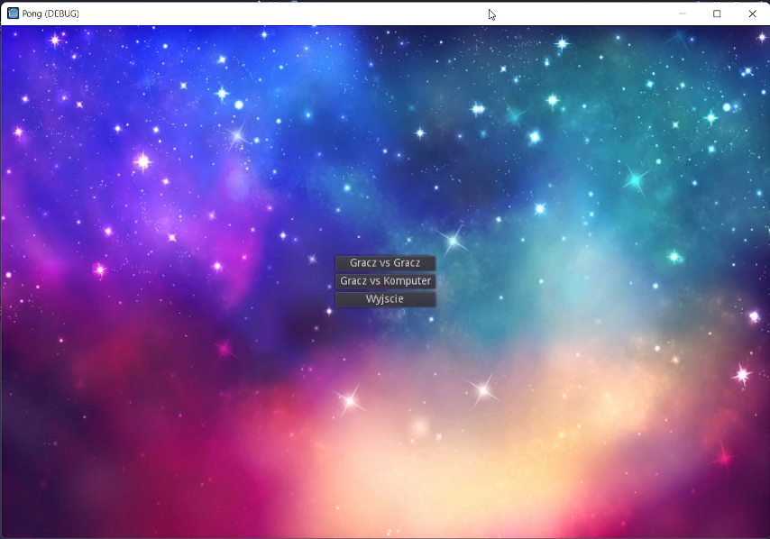

# Prosta gra "Pong" w Godot Engine

## Opis

Prosta gra "Pong" jest popularną grą zręcznościową, która została zaprogramowana przy użyciu silnika Godot Engine. Gra ma prostą mechanikę, w której dwaj gracze sterują paletkami, starając się odbijać piłeczkę i zdobywać punkty. Gra kończy się, gdy jeden z graczy osiągnie określoną liczbę punktów.

## Instrukcje

1. Gracz 1 (lewa paletka) porusza się górą i dołem przy użyciu strzałek góra/dół na klawiaturze.
2. Gracz 2 (prawa paletka) porusza się górą i dołem przy użyciu klawiszy W/S na klawiaturze.
3. Gra rozpoczyna się automatycznie po uruchomieniu.
4. Gracze starają się odbijać piłeczkę, aby nie przeleciała przez ich paletki.
5. Za każde trafienie przeciwnika, zdobywasz punkt.

## Technologie

Gra "Pong" została stworzona przy użyciu następujących technologii:

- Silnik: Godot Engine
- Język programowania: GDScript

## Autor

Gra została stworzona przez: Your Name
